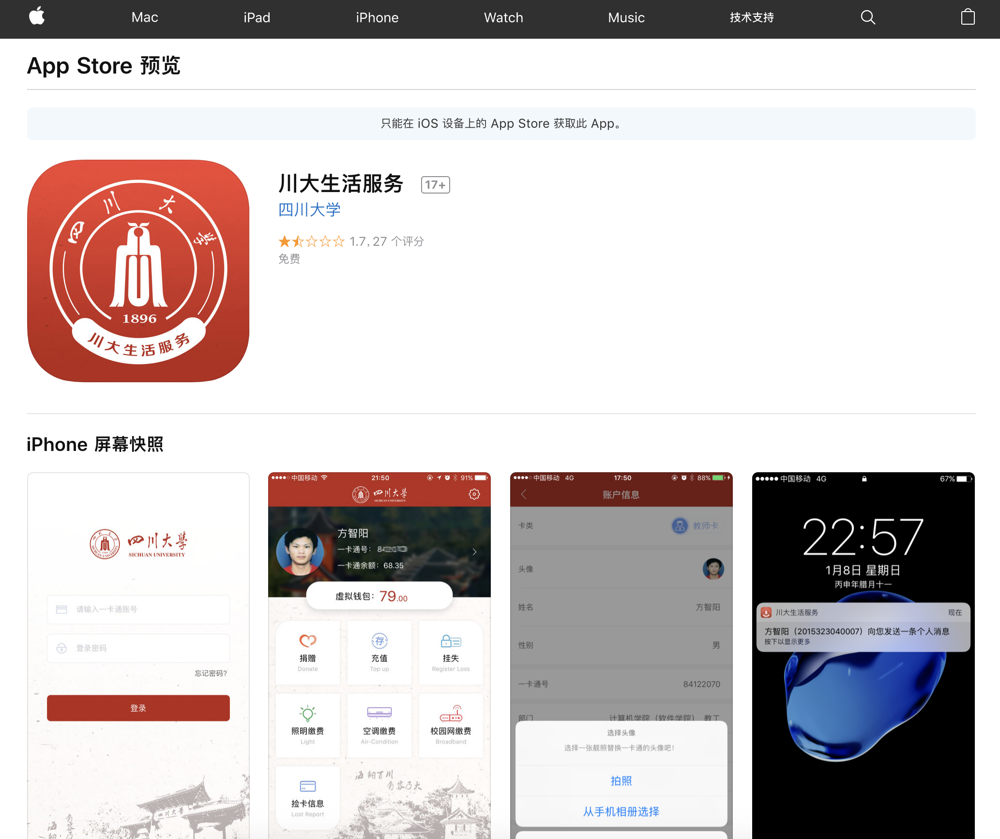
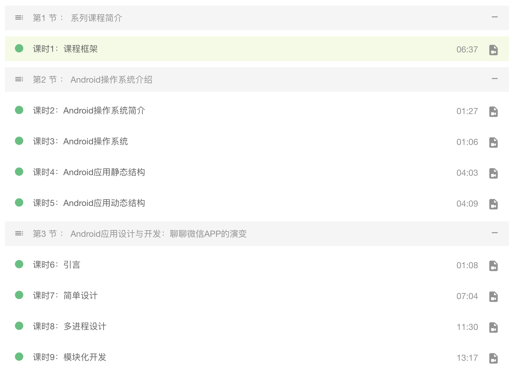
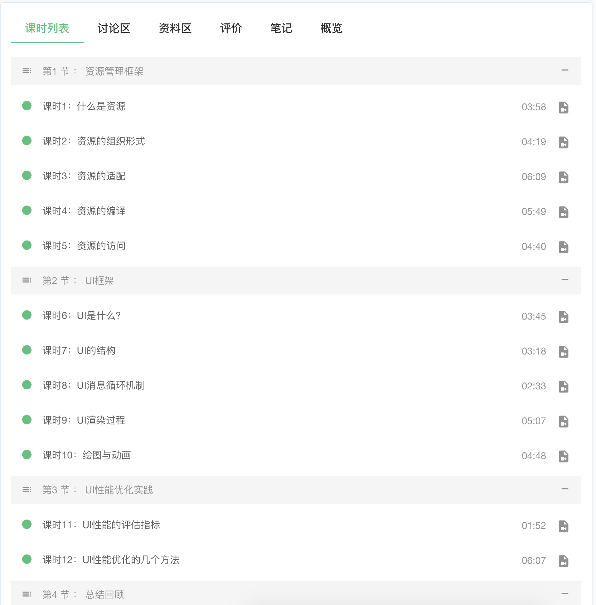

# 《微信移动终端开发》课程安排

**课程性质**：面向四川大学计算机学院本科大二、大三学生， 依据学生专业课成绩、综合素质、获奖情况及求学意愿，由腾讯讲师和校内讲师筛选，最终确定选课人数82人，24个学时，2个学分

**授课方式**：采用线上视频慕课学习 + 线下课堂学习的教学方式。线上由腾讯讲师通过教学视频进行授课。线下除第一次和最后一次课程腾讯讲师会到学校跟同学们面对面交流之外，中间由校内老师组织线下课堂

- `线上视频学习`：通过[腾讯大学](http://scu.daxueqq.edusoho.cn/)的网络授课平台进行，视频由腾讯资深架构师录制；
- `线下课堂学习`：由四川大学计算机学院教师进行授课与答疑指导。

**课程目标**：通过项目实践，提升学生动手能力，将所学知识整合运用到移动终端开发相关项目中

- 开发技能：通过代码编写与阅读，训练学生编写程序的熟练性和规范性；
- 项目经验：通过完成项目案例和阶段项目实战，增加对实际软件项目开发的体验与积累；
- 综合素质：通过项目组角色分配、技术研讨等多种训练手段，培养学生良好的职业习惯。

**课程信息**：

- 课序号：`304206020`
- 授课教师：方智阳* 陈岳伟 赵原 周志杰 刘艺恒 饶珺 卢正坤	 
- 课程时间： 4-15周周五3~4节
- 课程地点：四川大学江安校区二基楼B301

|         **课程时间**         | **主要负责讲师**  | **授课方式** |
| :--------------------------: | :---------------: | :----------: |
|        第四周（3.30）        | 腾讯讲师+校内老师 |   线下课堂   |
|        第五周（4.6）         |     校内老师      |   线下课堂   |
|        第六周（4.13）        |     腾讯讲师      |   线上视频   |
|        第七周（4.20）        |     校内老师      |   线下课堂   |
|        第八周（4.27）        |     校内老师      |   线下课堂   |
|        第九周（5.4）         |     腾讯讲师      |   线上视频   |
|        第十周（5.11）        |     校内老师      |   线下课堂   |
|       第十一周（5.18）       |     校内老师      |   线下课堂   |
|       第十二周（5.25）       |     校内老师      |   线下课堂   |
| 第十三（6.1）、十四周（6.8） |     校内老师      |   线下课堂   |
|       项目验收（6.15）       | 腾讯讲师+校内老师 |   线下课堂   |

**考核方式 ：** 5-6 人自由组成团队，完成小组自行选择的小程序开发、Android开发项目任务。验收通过后即可

获得四川大学`2个选修学分`及`腾讯签发的结业证书`。

> 课程相关代码资源查看Github项目[MobileDevCourse](https://github.com/fanmcgrady/MobileDevCourse)
>
> 地址：https://github.com/fanmcgrady/MobileDevCourse

-----

## 课程资源

本Github项目展示了《微信移动终端开发》课程上涉及到的相关代码和课程资源

用[微信开发者工具](https://mp.weixin.qq.com/debug/wxadoc/dev/devtools/download.html)打开整个项目，Lesson* 目录里面是每节课涉及到的代码和工程，部分内容可能和小程序工程无关

## Lesson1

1. 介绍课程整体内容，重点微信移动端开发，课程的要求.
1. 微信公众号，微信小程序入门.
1. 介绍HTML，JavaScript，CSS基础.
1. 使用web-view标签简单模拟微信小程序HelloWorld程序.
1. 介绍微信小程序HelloWorld.

> lesson1文件夹中，包含了一个小程序官方Hello World程序，已经按照这个结构，课堂上演示的模拟的一个纯HTML的Hello World程序

## Lesson2

1. 回顾上节课小程序前端的内容，前端weui
1. 介绍服务器后端开发的基础知识，以Java Servlet为例.
    * 课程中涉及到的前端网站：http://www.bootcss.com/
1. 介绍上节课课后意见反馈页面的编写流程，以小程序为例再次演示同样的功能基于小程序的实现.

> lesson2文件夹中，包含了一个基于Weui的“意见反馈页面”的小程序端实现，以及课堂上演示的基于Servlet的一个Java后端Hello World程序（直接使用intellj idea打开这个项目，项目是以工程的形式上传）

## Lesson3

1. 介绍上节课课后意见反馈页面的编写流程，以小程序为例再次演示同样的功能基于小程序的实现.
1. 上节课介绍的Servlet例子，作为服务器，接入小程序反馈页面后台.
1. 介绍“2015级微信公众号”后端查询用户基本信息的业务流程，顺便介绍公众号开发的基础知识，以及巩固服务器端开发的概念.
1. 展示一个我已经实现的微信公众号黑科技.
1. 相关工具使用：
   * intellj下如何引入github项目
   * 重新演示如何搭建这个tomcat服务器
   * [git简易使用指南](http://www.bootcss.com/p/git-guide/)
   
## Lesson4

1. 展示一个我已经实现的微信公众号黑科技.

1. 展示我开发的四川大学校内充值APP程序[川大生活服务](https://itunes.apple.com/cn/app/chuan-da-sheng-huo-fu-wu/id1155911714?mt=8)iOS和Android端代码结构.

   

1. 介绍移动终端开发第一章：Android应用设计与开发.
  

1. 简单介绍notejs使用，开发一个简单的后台

## Lesson5

1. 小程序使用过程的几个问题：页面见传参，访问网页，全局变量.
1. 黑科技：深度强化学习（Deep Reinforcement Learning）Hello World. 
   * `Catepole-v0`小杆游戏 Hello World，使用random方法控制小杆平衡，使用强化学习方法控制小杆平衡
   * 机器学习入门资料，[Google InnoCamp](http://innocamp.zucc.edu.cn:3000/)
1. 介绍移动终端开发第二章：Android UI技术探究与应用.

#### 小程序全局变量

微信小程序里面有个app.js，我们可以在这个里面设置全局变量，像酱
```javascript
App({  
     data:{  
         servsers:"http://192.168.0.253:3000"  
      }  
})  
```
在外面就这样引用就可以了，这个真的是简单
```javascript
getApp().data.servsers
```
#### 页面见传参
```html
<!-- sample.wxml -->
<navigator url="../navigator/navigator?title=我是navigate" >跳转到新页面</navigator>    
<navigator url="../redirect/redirect?title=我是redirect" redirect>在当前页打开</navigator>    
```
页面接收参数
```javascript
// redirect.js navigator.js
Page({
  onLoad: function(options) {
    this.setData({
      title: options.title
    })
  }
})
```

#### RL 示例
```python
class randomAgent():
    """The world's simplest graduation_agent!"""

    def __init__(self, action_space):
        self.action_space = action_space

    def act(self, observation):
        return self.action_space.sample()

    def stop_episode(self):
        pass

    def load(self, model_name):
        pass


# 使用gym的CartPole游戏
env = gym.make('CartPole-v0')

# 随机的方法创建智能体
agent = randomAgent(env.action_space)

# 强化学习的方法创建智能体
# agent = createAgentDQN(env)
# 现场训练模型
# trainingAgent(agent, env)
# 加载训练好的模型
# agent.load("cart")

# 循环运行10次游戏，对agent进行测试
for i_episode in range(10):
    observation = env.reset()
    R = 0
    for t in range(200):
        # env.render()
        action = agent.act(observation)
        observation, reward, done, info = env.step(action)
        R += reward
        if done:
            print("{}:Episode finished after {} timesteps, reward {}".format(i_episode, t + 1, R))
            break
    agent.stop_episode()
```

## Lesson6

1. 第三章，Android安全开发。介绍如何实现开发过程中的接口加密。 

2. 第四章，终端存储技术。介绍JSON，XML的使用，介绍数据库SQL语句的简单实例。 

3. 第五章，终端网络技术。介绍网络协议的基础知识。 


#### JSON数据格式
```json
{
	"type": 1,
	"result": 0,
	"resultMsg": "操作成功",
	"cardId": "84122070",
	"days": 7,
	"contents": [{
		"address": "江安东园一餐厅",
		"amount": "500",
		"charge": "540.0",
		"type": 1,
		"salaryNo": "84122070",
		"dealType": "消费",
		"dealTime": "2018-05-22 12:38:37"
	}, {
		"address": "江安东园一餐厅",
		"amount": "560.0",
		"charge": "1040.0",
		"type": 1,
		"salaryNo": "84122070",
		"dealType": "消费",
		"dealTime": "2018-05-22 12:38:11"
	}, {
		"address": "江安东园一餐厅",
		"amount": "560.0",
		"charge": "1600",
		"type": 1,
		"salaryNo": "84122070",
		"dealType": "消费",
		"dealTime": "2018-05-22 12:38:03"
	}, {
		"address": "校园交通车",
		"amount": "0",
		"charge": "2160.0",
		"type": 1,
		"salaryNo": "84122070",
		"dealType": "消费",
		"dealTime": "2018-05-22 09:10:08"
	}, {
		"address": "校园交通车",
		"amount": "0",
		"charge": "2160.0",
		"type": 1,
		"salaryNo": "84122070",
		"dealType": "消费",
		"dealTime": "2018-05-18 16:41:36"
	}, {
		"address": "江安东园一餐厅",
		"amount": "560.0",
		"charge": "4198.00",
		"type": 1,
		"salaryNo": "84122070",
		"dealType": "消费",
		"dealTime": "2018-05-18 12:21:22"
	}],
	"startDate": "2018-05-18",
	"endDate": "2018-05-25"
}
```

